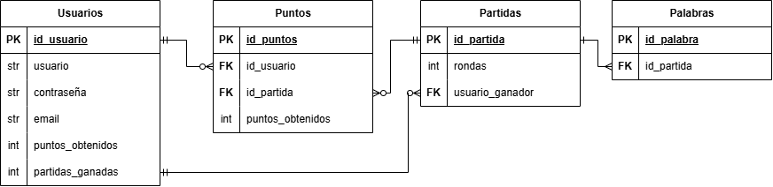

# 2026-TPF-G04
## 5to A Informática Desarrollo de Aplicaciones Informáticas

## Integrantes:

- Maggiolo Florencia
- Panelli Sabrina
- Pujana Francisco

## Descripción del proyecto
### Nombre de la aplicación: "Pintupio"
### Descripción general:
Juego multijugador que se basa en adivinar una palabra aleatoria que se le asigna a un jugador a través de su representación pintada sobre un lienzo
### Problemática o necesidad que aborda:
La idea es pasar el rato, hacer algo divertido con amigos a la distancia.
### Público objetivo:
Cualquier persona que tenga ganas de pasar un rato entretenido.
### Objetivo general:
Desarrollar una aplicación web funcional que integre todo lo que estuvimos trabajando durante todo el año (Frontend, Backend, Base de datos, pedidos HTTP, comunicación entre clientes, etc.) para que los usuarios puedan conectarse, jugar y pasar un buen rato.
### Principales funcionalidades:

- **Login:** Iniciar sesión fácil para entrar directo a jugar con el perfil guardado.
- **Registro:** Crear tu cuenta si todavía no existe una.
- **Salas:** Crear salas privadas para jugar con amigos o unirse a una sala creada por amigos.
- **Juego en sí:** La pantalla de la partida completa que incluye el lienzo para dibujar, el cronómetro con el tiempo límite, el chat para arriesgar respuestas y el marcador de puntos por ronda.

## Diseño
https://canva.link/isrbpnny3a8bp8q

## DER

## Tabla de planificación de tareas

| Tarea | Responsable | Fecha estimada |
| :--- | :--- | :-: |
| Creación de tablas | Maggiolo | 07/10 |
| Backend con conexión a la BD y pedidos `HTTP` | Panelli | 09/10 |
| Registro (componentes `botón`, `input`, `title`) | Pujana | 13/10 |
| Login | Maggiolo | 16/10 |
| Backend con conexión `socket` | Panelli | 20/10 |
| Página principal (tablas de clasificación) | Pujana | 24/10 |
| Juego: número de sala, la ronda actual y lienzo de dibujo | Panelli | 30/10 |
| Juego: chat con `socket`, puntos del usuario y temporizador *(una vez terminada la partida, aparecen los puntos de todos los usuarios de la sala)* | Maggiolo | 06/11 |
| `CSS` general | Maggiolo | 12/11 |
| `CSS` página de juego | Panelli | 12/11 |
| OPCIONAL: revisión general final (correcciones) | Todos los integrantes | 16/11 |
| **EXPOPIO** | Todos los integrantes | 20/11 |